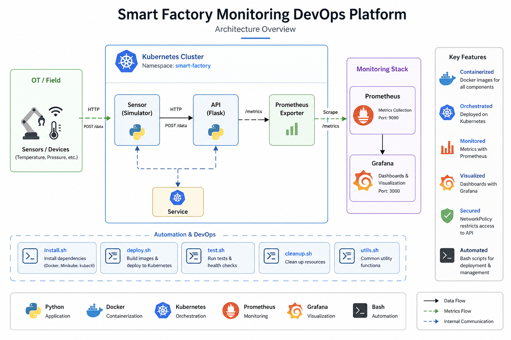

# 🏭 Smart Factory Monitoring DevOps Platform

## 🎯 Objectif du projet

Ce projet a pour objectif de simuler une plateforme industrielle connectée, dans laquelle des capteurs génèrent des données envoyées vers une API pour être collectées, traitées et surveillées en temps réel.

Il permet de comprendre comment les systèmes industriels (OT) interagissent avec les systèmes informatiques (IT), tout en mettant en pratique une approche DevOps basée sur la containerisation, l’orchestration avec Kubernetes et le monitoring.

---

## 🧰 Environnement technique

Le projet s’appuie sur un environnement technique moderne, proche des standards utilisés en entreprise :

- **OS** : Linux (Ubuntu)
- **Langage** : Python (Flask)
- **Scripting** : Bash
- **Conteneurisation** : Docker
- **Orchestration** : Kubernetes (Minikube)
- **Monitoring** : Prometheus et Grafana

## 🧱 Architecture du projet

L’architecture de ce projet repose sur une chaîne simple qui représente le fonctionnement d’un système industriel connecté.

Les capteurs (simulés) génèrent des données et les envoient vers une API déployée dans un cluster Kubernetes. Cette API traite les données et expose des métriques via un endpoint dédié.

Prometheus collecte ensuite ces métriques automatiquement, puis Grafana permet de les visualiser sous forme de dashboards pour surveiller le système en temps réel.

L’ensemble des composants est orchestré avec Kubernetes, ce qui permet de gérer la communication entre services, la scalabilité et la résilience de l’application.




## 📁 Structure du projet

Le projet est organisé de manière claire afin de séparer le code applicatif, l’infrastructure et l’automatisation.

```bash
.
├── app
│   ├── api
│   │   └── api.py
│   └── sensor
│       └── sensor.py
├── docker
│   ├── api.Dockerfile
│   └── sensor.Dockerfile
├── k8s
│   ├── api.yaml
│   ├── grafana.yaml
│   ├── namespace.yaml
│   ├── network-policy.yaml
│   ├── prometheus.yaml
│   ├── sensor.yaml
│   └── service.yaml
├── logs
├── monitoring
│   └── prometheus.yaml
├── scripts
│   ├── cleanup.sh
│   ├── deploy.sh
│   ├── install.sh
│   ├── test.sh
│   └── utils.sh
├── .env
├── .gitignore
└── README.md
```


## 📂 Rôle des dossiers

Chaque dossier du projet a un rôle spécifique afin de séparer clairement les responsabilités.

- **app/** : contient le code de l’application  
  → API (Flask) pour recevoir les données  
  → Sensor pour simuler les capteurs  

- **docker/** : contient les Dockerfiles pour construire les images des services  

- **k8s/** : contient tous les fichiers Kubernetes (déploiement, services, sécurité)  
  → définit comment l’application est exécutée et connectée dans le cluster  

- **monitoring/** : configuration de Prometheus  
  → permet de définir quelles métriques sont collectées  

- **scripts/** : scripts Bash pour automatiser les tâches  
  → déploiement, tests, nettoyage  
  → évite d’exécuter manuellement plusieurs commandes  

- **logs/** : stockage des logs (utilisé pour debug)  

- **.env** : variables d’environnement pour configurer l’application  


## ▶️ Exécution et tests

Le projet peut être lancé de deux manières : soit de façon automatisée avec un script Bash, soit manuellement pour comprendre chaque étape.

---

### 🚀 Option 1 — Exécution automatisée (recommandée)

Un script Bash est disponible pour automatiser l’ensemble du déploiement .
Avant de lancer le script, il faut lui donner les droits d’exécution :

```bash
chmod +x scripts/k8s.sh scripts/k8s-clean.sh
```
Ensuite, exécuter :

```bash
./scripts/k8s.sh
```

Ce script permet de :

* **Construire** les images Docker
* **Déployer** l’application sur Kubernetes
* **Lancer** Prometheus et Grafana
* **Tester** automatiquement l’API

### 🔧 Option 2 — Exécution manuelle

#### 1. Construire les images

```bash
minikube image build -t smart-factory-api:local -f docker/api.Dockerfile .
minikube image build -t smart-factory-sensor:local -f docker/sensor.Dockerfile .
```

#### 2. Déployer sur Kubernetes

```bash
kubectl apply -f k8s/namespace.yaml
kubectl apply -f k8s/
kubectl apply -f monitoring/prometheus.yaml
```

#### 3. Vérifier les pods

```bash
kubectl get pods -n smart-factory
```

#### 4. Tester l’API

```bash
kubectl port-forward svc/api 5000:5000 -n smart-factory
curl http://localhost:5000/health
```

#### 5. Vérifier les métriques

```bash
curl http://localhost:5000/metrics
```

## 📊 Configuration du monitoring

Une fois le projet lancé, il est possible d’accéder aux outils de monitoring et de visualisation.

---

### 🔎 Accès à Prometheus

```bash
kubectl port-forward svc/prometheus 9090:9090 -n smart-factory
````

Puis ouvrir dans le navigateur :

👉 [http://localhost:9090](http://localhost:9090)

Dans l’interface Prometheus, tester la métrique suivante :

```
sensor_messages_total
```

Cela permet de vérifier que les données envoyées par les capteurs sont bien collectées.

---

### 📈 Accès à Grafana

```bash
kubectl port-forward svc/grafana 3000:3000 -n smart-factory
```

Puis ouvrir :

👉 [http://localhost:3000](http://localhost:3000)

Identifiants par défaut :

* user : admin
* password : admin

---

### ⚙️ Connexion de Prometheus à Grafana

1. Aller dans **Settings (⚙️) → Data Sources**
2. Cliquer sur **Add data source**
3. Choisir **Prometheus**
4. Dans le champ URL, entrer :

```
http://prometheus:9090
```

5. Cliquer sur **Save & Test**

---

### 📊 Création d’un dashboard

1. Aller dans **Dashboards → New Dashboard**
2. Cliquer sur **Add new panel**
3. Dans la section Query, entrer :

```
sensor_messages_total
```

4. Cliquer sur **Apply**, puis sauvegarder le dashboard


###  Nettoyage de l’environnement

Pour supprimer tous les déploiements et repartir d’un environnement propre :

```bash
./scripts/k8s_cleanup.sh
```

Ou manuellement :

```bash
kubectl delete -f k8s/
kubectl delete -f monitoring/prometheus.yaml
kubectl delete namespace smart-factory
```

---